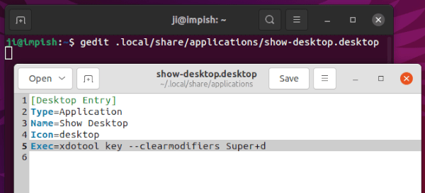
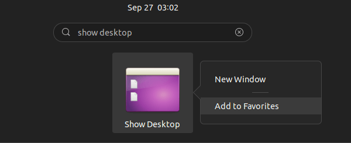
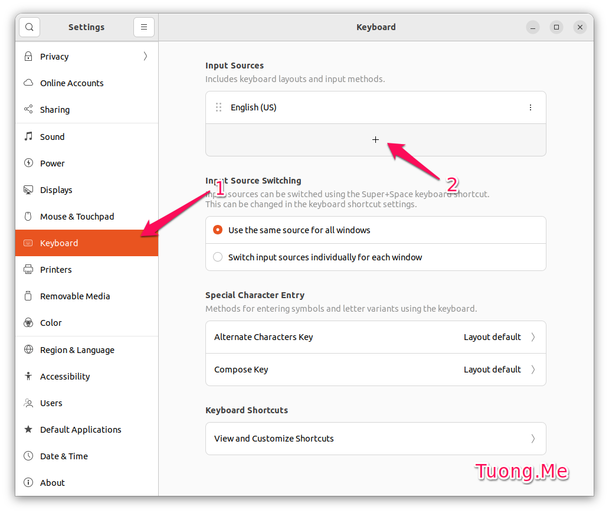
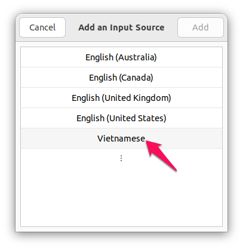
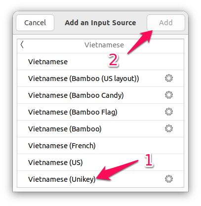
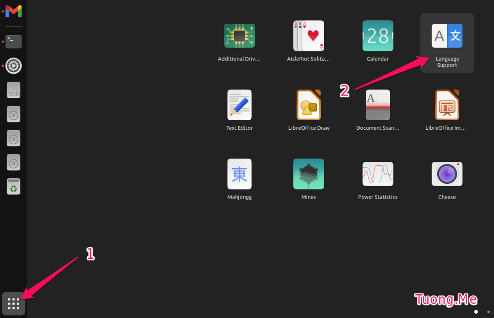
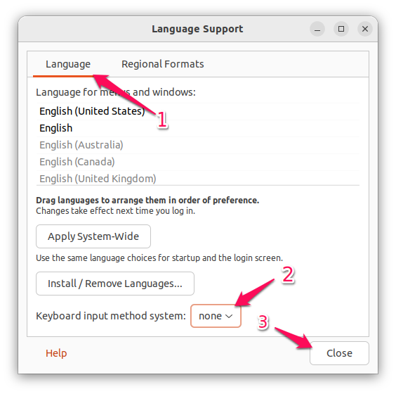

# Cài đặt Ubuntu

## I. Link tải xuống Ubuntu

- [Trên trang chủ](https://ubuntu.com/download)
- [Ubuntu 22.04.2 LTS](https://ubuntu.com/download/desktop/thank-you?version=22.04.2&architecture=amd64)
- [Ubuntu 20.04.6 LTS](https://ubuntu.com/download/desktop/thank-you?version=20.04.6&architecture=amd64)
- [Rufus](https://rufus.ie/downloads/) (Phần mềm tạo USB cài win)

## II. Cài đặt drivers

```bash
sudo ubuntu-drivers autoinstall
sudo apt update
sudo apt upgrade -y
```

<!--
### Cài đặt NVIDIA Driver

- [CUDA Toolkit](https://developer.nvidia.com/cuda-11-8-0-download-archive?target_os=Linux&target_arch=x86_64&Distribution=Ubuntu&target_version=22.04&target_type=runfile_local)
- [NVIDIA cuDNN](https://developer.nvidia.com/rdp/cudnn-archive) -->

## III. Cài đặt phần mềm

### 1. Cài đặt các phần mềm thường dùng và trình biên dịch

- [Snap Store](https://snapcraft.io)

```bash
killall snap-store
sudo snap refresh
```

- Phần mềm cần cài đặt bằng Ubuntu Store

  > - kolourpaint
  > - libreoffice
  > - OBS Studio
  > - postman
  > - qBittorrent
  > - VLC

- Phần mềm cài bằng file _.deb_

  > - [Microsoft Edge](https://www.microsoft.com/vi-vn/edge/download)
  > - [Google Chrome](https://www.google.com/intl/vi/chrome/)
  > - [Studio 3T](https://studio3t.com/download/)
  > - [MySQL Workbench](https://dev.mysql.com/downloads/workbench/)
  > - [Vs Code](https://code.visualstudio.com/Download)

  - Lệnh cài đặt _.deb_ file

  ```bash
  sudo dpkg -i <tên file>.deb -y
  ```

  - Thêm _`Open with Code`_ vào menu chuột phải

  ```bash
  wget -qO- https://raw.githubusercontent.com/vuxuanhoang000/he-dieu-hanh/master/software/install.sh | bash
  ```

- [Telegram](https://desktop.telegram.org/)

```bash
sudo apt install telegram-desktop
```

- [Brave](https://brave.com/linux/)

  - Gỡ cài đặt **FireFox**

  ```bash
  sudo apt-get purge firefox
  rm -rf ~/.mozilla
  ```

  - Cài đặt **Brave**

  ```bash
  sudo apt install curl
  sudo curl -fsSLo /usr/share/keyrings/brave-browser-archive-keyring.gpg https://brave-browser-apt-release.s3.brave.com/brave-browser-archive-keyring.gpg
  echo "deb [signed-by=/usr/share/keyrings/brave-browser-archive-keyring.gpg] https://brave-browser-apt-release.s3.brave.com/ stable main"|sudo tee /etc/apt/sources.list.d/brave-browser-release.list
  sudo apt update
  sudo apt install brave-browser
  ```

- [Git](https://git-scm.com/download/linux)

```bash
sudo apt install git -y
git config --global user.name "Vu Xuan Hoang"
git config --global user.email vuxuanhoang000@gmail.com
git config --global core.editor "code --wait"
```

- [GCC &amp; G++](https://sourceforge.net/projects/mingw-w64/files/)

```bash
sudo apt install build-essential -y
```

- [Java](https://www.oracle.com/vn/java/technologies/downloads/)

```bash
sudo apt install openjdk-17-jre-headless -y
sudo apt install openjdk-17-jdk-headless -y
java -version
javac -version
```

- [Python](https://www.python.org/downloads/)

```bash
sudo apt install python3 -y
sudo apt install python3-pip -y
sudo apt install python3-venv -y
```

or

```bash
sudo apt update
sudo apt install -y make build-essential libssl-dev zlib1g-dev libbz2-dev libreadline-dev libsqlite3-dev wget curl llvm libncurses5-dev libncursesw5-dev xz-utils tk-dev
cd ~/Downloads
wget https://www.python.org/ftp/python/3.10.10/Python-3.10.10.tgz
tar -xf Python-3.10.10.tgz
cd Python-3.10.10
./configure --enable-optimizations --with-ensurepip=install
make -j 4 # hãy sửa đổi -j để tương ứng với số lượng lõi trong bộ xử lý của máy. Bạn có thể lấy bằng cách gõ nproc.
sudo make altinstall
python3.10 --version
```

- [NodeJs](https://github.com/nodesource/distributions)

```bash
sudo apt install curl -y
curl -sL https://deb.nodesource.com/setup_16.x | sudo -E bash -
sudo apt update
sudo apt install nodejs -y
node --version
npm --version
```

- [MySql](https://www.mysql.com/)

```bash
sudo apt install mysql-server -y
mysql --version
systemctl is-active mysql
sudo mysql
```

```sql
UNINSTALL COMPONENT 'file://component_validate_password';
ALTER USER 'root'@'localhost' IDENTIFIED WITH mysql_native_password BY '123';
exit;
```

```bash
sudo mysql -u root --password=123
```

```sql
show databases;
create database first-database;
show databases;
exit;
```

```bash
systemctl status mysql.service
```

- [MongoDb](https://www.mongodb.com/docs/manual/tutorial/install-mongodb-on-ubuntu/)

```bash
# 1. Import the public key used by the package management system.
sudo apt-get install gnupg
curl -fsSL https://pgp.mongodb.com/server-6.0.asc | \
   sudo gpg -o /usr/share/keyrings/mongodb-server-6.0.gpg \
   --dearmor

# 2. Create a list file for MongoDB.
echo "deb [ arch=amd64,arm64 signed-by=/usr/share/keyrings/mongodb-server-6.0.gpg ] https://repo.mongodb.org/apt/ubuntu jammy/mongodb-org/6.0 multiverse" | sudo tee /etc/apt/sources.list.d/mongodb-org-6.0.list

# 3. Reload local package database.
sudo apt-get update

# 4. Install the MongoDB packages.
sudo apt-get install -y mongodb-org

# 5. Run MongoDB Community Edition
# 5.1 Start MongoDB.
sudo systemctl start mongod

sudo systemctl daemon-reload

# 5.2 Verify that MongoDB has started successfully.
sudo systemctl status mongod

sudo systemctl enable mongod

# 5.3 Stop MongoDB.
sudo systemctl stop mongod

# 5.4 Restart MongoDB.
sudo systemctl restart mongod

# 5.5 Begin using MongoDB.
mongosh
```

- [FFMPEG Thumbnailer](https://apps.kde.org/ffmpegthumbs/)

```bash
sudo apt install ffmpegthumbnailer -y
sudo rm /usr/share/thumbnailers/totem.thumbnailer
```

### 2. Thêm Show-Desktop Shortcut

```bash
sudo apt-get install xdotool -y
gedit ~/.local/share/applications/show-desktop.desktop
```

```plaintext
[Desktop Entry]
Type=Application
Name=Show Desktop
Icon=desktop
Exec=xdotool key --clearmodifiers Super+d
```



> Tìm kiếm **_Show Desktop_**



### 3. Cài bộ gõ tiếng việt Ibus-Teni

```bash
sudo add-apt-repository ppa:teni-ime/ibus-teni
sudo apt-get update
sudo apt-get install ibus-teni
ibus restart
sudo usermod -a -G input $USER
```

- Vào **_Settings_** -> **_Keyboard_** nhấn vào dấu **_+_** trong phần **_Input Sources_** như hình.



- Một cửa sổ nhỏ hiện ra các bạn nhấn chọn vào **_Vietnamese_**.



- Chọn vào mục **_Vietnamese (Teni)_** rồi nhấn **_Add_** để thêm bộ gõ tiếng Việt cho Ubuntu.



- Nếu bạn không tìm thấy **_Vietnamese (Teni)_** trong danh sách thì hãy khởi động lại máy tính và thử lại.
- Tiếp theo nhấn chọn vào **_Show Applications_** và chạy ứng dụng **_Language Support_**.



- Trong giao diện công cụ này, ở tab **_Language_** tìm đến **_Keyboard input method system_** và chuyển giá trị từ **_Ibus_** sang **_none_**.



- Bây giờ ở trên góc trên cùng bên phải có biểu tượng để chuyển giữa **_en_** và **_vi_** thì lúc này ta đã cài **_unikey_** cho Ubuntu thành công. Bước tiếp theo bạn chỉ cần thay đổi bộ gõ sang **_Vietnamese (Teni)_** để sử dụng.

### 4. Tạo Git SSH Keys

- Mở **_Terminal_**

```bash
ssh-keygen -t ed25519 -C vuxuanhoang000@gmail.com
```

- Copy **_key_** ở file **`~/.ssh/id_ed25519.pub`** (**_key_** là toàn bộ nội dung của file)
- Tạo SSH keys ở [Github](https://github.com/settings/keys) và [Gitlab](https://gitlab.com/-/profile/keys) và dán **_key_** đã copy.
