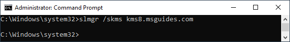

# Cài đặt Windows 10 & 11

## I. Link tải xuống Windows

- [Windows 10](https://www.microsoft.com/en-us/software-download/windows10ISO) (Lưu ý mở ở chế độ mobile -> Ctrl+Shift+I -> Ctrl+Shift+M -> F5 Reload)
- [Windows 11](https://www.microsoft.com/en-us/software-download/windows11)
- Có thể tải xuống bằng phần mềm [HeiDoc.net](software/Windows-ISO-Downloader.exe)
- [Rufus](https://rufus.ie/downloads/) (Phần mềm tạo USB cài win)
- [ei.cfg](software/ei.cfg) (Để USB cài win cho phép người dùng chọn phiên bản Windows, copy vào USB/sources)

## II. Kích hoạt Windows

### 1. Kích hoạt bằng Tool

- **Lưu ý**: Chỉ dùng cho Windows 10. Nhớ tắt [Windows Security](https://www.google.com/search?q=T%E1%BA%AFt+Windows+Security) trước khi chạy và phải chạy tool dưới quyền quản trị (**Run as Administrator**)
- [Activate AIO Tools v3.1.3](software/Activate%20AIO%20Tools%20v3.1.3%20-%20Pass%20giai%20nen%20la%20HQCNTH.7z) (Password: HQCNTH)
- [Microsoft Toolkit 2.7.1](software/Microsoft%20Toolkit%202.7.1.rar) (Password: win10.vn)

### 2. Kích hoạt bằng lệnh

_Bước 1:_ Mở Command Prompt (**CMD**) dưới quyền quản trị (**Run as Administrator**)


_Bước 2:_ Cài đặt **KMS client key**.

```console
slmgr /ipk <KMS client key>
```

> - Danh sách key bản quyền **Windows 10**.
>   - **Home:** TX9XD-98N7V-6WMQ6-BX7FG-H8Q99
>   - **Home N:** 3KHY7-WNT83-DGQKR-F7HPR-844BM
>   - **Home Single Language:** 7HNRX-D7KGG-3K4RQ-4WPJ4-YTDFH
>   - **Home Country Specific:** PVMJN-6DFY6-9CCP6-7BKTT-D3WVR
>   - **Professional:** W269N-WFGWX-YVC9B-4J6C9-T83GX
>   - **Professional N:** MH37W-N47XK-V7XM9-C7227-GCQG9
>   - **Education:** NW6C2-QMPVW-D7KKK-3GKT6-VCFB2
>   - **Education N:** 2WH4N-8QGBV-H22JP-CT43Q-MDWWJ
>   - **Enterprise:** NPPR9-FWDCX-D2C8J-H872K-2YT43
>   - **Enterprise N:** DPH2V-TTNVB-4X9Q3-TJR4H-KHJW4

> - Danh sách key bản quyền **Windows 11**.
>   - **Home:** TX9XD-98N7V-6WMQ6-BX7FG-H8Q99
>   - **Home N:** 3KHY7-WNT83-DGQKR-F7HPR-844BM
>   - **Home Single Language:** 7HNRX-D7KGG-3K4RQ-4WPJ4-YTDFH
>   - **Home Country Specific:** PVMJN-6DFY6-9CCP6-7BKTT-D3WVR
>   - **Pro:** W269N-WFGWX-YVC9B-4J6C9-T83GX
>   - **Pro N:** MH37W-N47XK-V7XM9-C7227-GCQG9
>   - **Education:** NW6C2-QMPVW-D7KKK-3GKT6-VCFB2
>   - **Education N:** 2WH4N-8QGBV-H22JP-CT43Q-MDWWJ
>   - **Enterprise:** NPPR9-FWDCX-D2C8J-H872K-2YT43
>   - **Enterprise N:** DPH2V-TTNVB-4X9Q3-TJR4H-KHJW4


_Bước 3:_ Đặt máy chủ KMS.

```console
slmgr /skms kms8.msguides.com
```



_Bước 4:_ Kích hoạt Windows.

```console
slmgr /ato
```


- Nếu gặp lỗi **0xC004F074** điều đó có nghĩa là kết nối internet của bạn không ổn định hoặc máy chủ đang bận. Hãy đảm bảo rằng thiết bị của bạn đang trực tuyến và thử lại lệnh "ato" cho đến khi thành công.


- Bây giờ hãy kiểm tra lại trạng thái kích hoạt.


## III. Drivers & phần mềm thiết yếu

### 1. Cài đặt Drivers

- [Driver Easy](software/Driver.Easy.Professional_5.6.15.34863.zip)

### 2. Phần mềm

- [Bộ gõ tiếng việt EVKey](https://evkeyvn.com/)
- [WinRar](https://www.rarlab.com/download.htm)
  - Sau khi cài đặt WinRar, Crack bằng cách mở [rarreg.rar](software/rarreg.rar) sau đó kéo thả [rarreg.key](software/rarreg.key) vào
- [Revo Uninstaller Pro](software/Revo.Uninstaller.Pro_v4.2.1.zip) (Password: 1)
- [HEVC Video Extension](software/Microsoft.HEVCVideoExtension_1.0.32762.0_x64__8wekyb3d8bbwe.Appx)
- [Foxit Reader](software/FoxitReader1011_enu_Setup_Prom.exe) (Cài khi muốn in tài liệu, cái này tốt hơn in bằng Word hoặc Microsoft Edge)
- [Internet Download Manager](software/Internet.Download.Manager_v6.40.Build.10.rar) (Cài nếu muốn download max speed - Không cần thiết lắm)
- [Mp3 Tags](software/mp3tagv304asetup.exe) (Dùng để thêm thông tin cho file nhạc)
- [Get Data Back](software/GetDataBack%204.33%20Full.zip) (Cài khi muốn khôi phục tệp bị xóa) (Password: 1)
- [Recuva](software/rcsetup153.exe) (Cài khi muốn khôi phục tệp bị xóa)
- [TeraCopy](software/TeraCopy_Pro.3.5.BETA.zip) (Cho tốc độ copy nhanh hơn - Không cần thiết lắm) (Password: 1)

### 3. Trình duyệt

- [Cốc Cốc](https://coccoc.com/)
- [Google Chrome](https://www.google.com/intl/vi/chrome/)

### 4. Mạng xã hội

- [Telegram](https://desktop.telegram.org/)

### 5. Office

- [Office Customization Tool](https://config.office.com/deploymentsettings)
- [Office Deployment Tool](https://www.microsoft.com/en-us/download/details.aspx)

  #### 5.1. Link tải

  - Office 2010: [32 bit](https://www.mediafire.com/file/owx1s2k5xp5tni7/MSOPP2k10_w32VLen.zip/file), [64 bit](https://www.mediafire.com/file/3x0fcdpnfpmwa45/MSOPP2k10_64bitVLen.zip/file)
  - Office 2013: [32 bit](https://www.mediafire.com/file/sdh4lvmbxukgwf2/MSOPP2k13_w32VLen.zip/file), [64 bit](https://www.mediafire.com/file/jxktyg8ufw4em7x/MSOPP2k13_64bitVLen.zip/file)
  - Office 2016: [32 bit](), [64 bit]()
  - Office 2019: [32&amp;64bit](https://officecdn.microsoft.com/pr/492350f6-3a01-4f97-b9c0-c7c6ddf67d60/media/en-us/ProPlus2019Retail.img)
  - Office 2021: [32&amp;64bit](https://officecdn.microsoft.com/db/492350f6-3a01-4f97-b9c0-c7c6ddf67d60/media/en-us/ProPlus2021Retail.img)

  #### 5.2. Kích hoạt

  _Bước 1:_ Dò tìm vị trí của Office được cài đặt trên PC của bạn.

  - Mở Command Prompt (**CMD**) dưới quyền quản trị (**Run as Administrator**)

  

  ```console
  if exist "%ProgramFiles%\Microsoft Office\Office14\ospp.vbs" set folder="%ProgramFiles%\Microsoft Office\Office14"
  if exist "%ProgramFiles(x86)%\Microsoft Office\Office14\ospp.vbs" set folder="%ProgramFiles(x86)%\Microsoft Office\Office14"
  if exist "%ProgramFiles%\Microsoft Office\Office15\ospp.vbs" set folder="%ProgramFiles%\Microsoft Office\Office15"
  if exist "%ProgramFiles(x86)%\Microsoft Office\Office15\ospp.vbs" set folder="%ProgramFiles(x86)%\Microsoft Office\Office15"
  if exist "%ProgramFiles%\Microsoft Office\Office16\ospp.vbs" set folder="%ProgramFiles%\Microsoft Office\Office16"
  if exist "%ProgramFiles(x86)%\Microsoft Office\Office16\ospp.vbs" set folder="%ProgramFiles(x86)%\Microsoft Office\Office16"
  cd %folder%
  ```

  

  _Bước 2:_ Kích hoạt Office của bạn bằng **KMS client key**.

  - Office 2010 hoặc 2013

  ```console
  cscript ospp.vbs /inpkey:VYBBJ-TRJPB-QFQRF-QFT4D-H3GVB
  cscript ospp.vbs /inpkey:YC7DK-G2NP3-2QQC3-J6H88-GVGXT
  cscript ospp.vbs /sethst:kms8.msguides.com
  cscript ospp.vbs /setprt:1688
  cscript ospp.vbs /act
  ```

  - Office 2016

  ```console
  cscript ospp.vbs /inpkey:XQNVK-8JYDB-WJ9W3-YJ8YR-WFG99
  cscript ospp.vbs /unpkey:BTDRB >nul
  cscript ospp.vbs /unpkey:KHGM9 >nul
  cscript ospp.vbs /unpkey:CPQVG >nul
  cscript ospp.vbs /sethst:e8.us.to
  cscript ospp.vbs /setprt:1688
  cscript ospp.vbs /act
  ```

  - Office 2019

  ```console
  cscript ospp.vbs /setprt:1688
  cscript ospp.vbs /unpkey:6MWKP >nul
  cscript ospp.vbs /inpkey:NMMKJ-6RK4F-KMJVX-8D9MJ-6MWKP
  cscript ospp.vbs /sethst:e8.us.to
  cscript ospp.vbs /act
  ```

  - Office 2021

  ```console
  cscript ospp.vbs /setprt:1688
  cscript ospp.vbs /unpkey:6F7TH >nul
  cscript ospp.vbs /inpkey:FXYTK-NJJ8C-GB6DW-3DYQT-6F7TH
  cscript ospp.vbs /sethst:e8.us.to
  cscript ospp.vbs /act
  ```

  

### 6. Tiện ích Microsoft Store

- [RecForth](https://www.microsoft.com/store/productId/9P03BZ82L9F2)
- [Pichon](https://www.microsoft.com/store/productId/9NK8T1KSHFFR)
- [Display color picker](https://www.microsoft.com/store/productId/9NLR7FSCC2CD)
- [Video Trim &amp; Merge](https://www.microsoft.com/store/productId/9PFDGVNPD3ZC)

### 7. Code

- [Dev-Cpp 5.11](software/Dev-Cpp%205.11%20TDM-GCC%204.9.2%20Setup.exe)
- [Trình biên dịch C &amp; C++ (v8.1.0)](software/x86_64-8.1.0-release-posix-seh-rt_v6-rev0.7z)
- [Visual Studio Code](https://code.visualstudio.com/Download)
- [Java Coding Pack](https://code.visualstudio.com/docs/java/java-tutorial)
- [Apache Netbeans](https://netbeans.apache.org/download/index.html)
- [Git](https://git-scm.com/download/win)

```bash
git config --global user.name "Vu Xuan Hoang"
git config --global user.email vuxuanhoang000@gmail.com
```

- [Python (v3.10.10)](https://www.python.org/downloads/release/python-31010/)
- [NodeJs](https://nodejs.org/en/blog/release)

### 8. SQL

- [SQL Server](https://www.microsoft.com/en-us/sql-server/sql-server-downloads)
- [XAMPP](https://sourceforge.net/projects/xampp/files/XAMPP%20Windows/)
